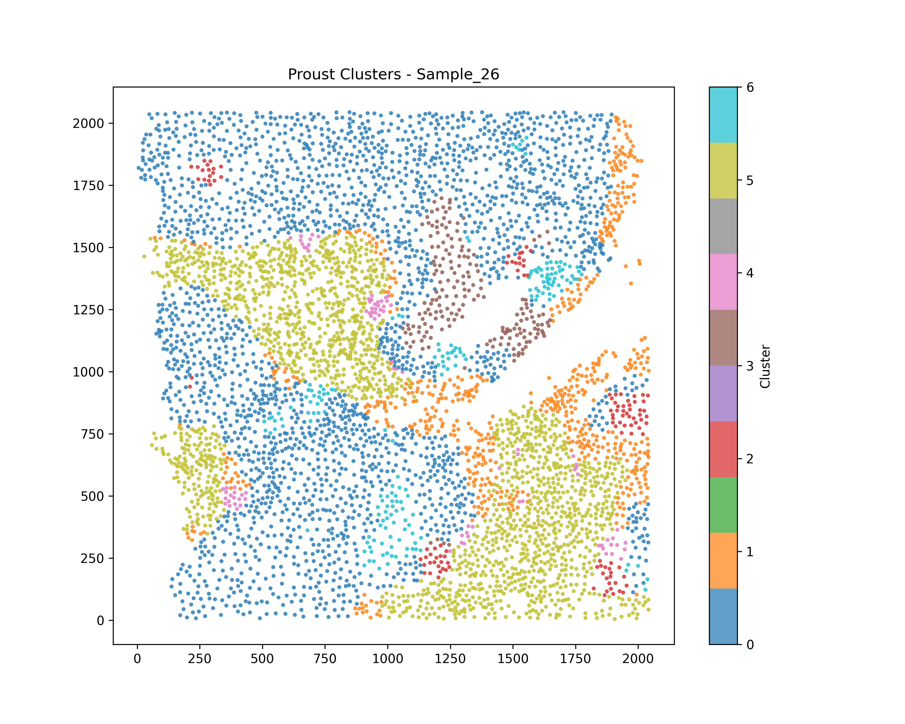

# Proust: Spatial Transcriptomics Analysis Package

## Mithun Manivannan Winter 2025

Proust is a computational framework for integrated spatial transcriptomics analysis that combines gene expression data with histology images to identify and analyze spatial domains in tissue samples.

## Output Visualization



_Example of spatial clusters identified by Proust in a Triple Negative Breast Cancer sample._

## Overview

This package provides tools for:

- Multi-modal spatial data integration
- Spatial domain identification through clustering
- Statistical testing of spatial domains using Maximum Mean Discrepancy (MMD)
- Integration with constrained hierarchical clustering
- Cell type-based spatial clustering and analysis

## Package Structure

- `proust/`: Core Python implementation of the Proust framework
  - `cluster.py`: Spatial clustering algorithms
  - `Train.py`: Core model training functions
  - `prep.py`: Data preprocessing utilities
  - `nnModels.py`: Neural network model definitions
  - `__init__.py`: Package initialization
- `R/`: R scripts for spatial statistics analysis
  - `create_blocks.R`: Functions to create blocks for MMD testing
  - `mmd_tests.R`: MMD statistical testing implementation
  - `evaluate_silhouette.R`: Functions for evaluating cluster quality
  - `modified_silhouette.R`: Custom spatial silhouette score implementation
  - `evaluate_pairwise_results.R`: Analysis of pairwise MMD test results
- `data/`: Example datasets for analysis
  - `03_TNBC_2018_spe.h5ad`: Triple Negative Breast Cancer dataset in AnnData format
  - `Cell_Data/`: Directory containing cell images and metadata
- `spatial_clusters_for_mmd/`: Output directory for spatial clustering results
- `vignettes/`: Analysis examples and tutorials
  - `TNBC_Application_Proust.qmd`: Triple Negative Breast Cancer (TNBC) application example
  - `Cell-type_demo.qmd`: Cell type-based spatial clustering analysis with one-hot encoded binary data
- `presentation/`: Conference presentation materials (OMSC 2025)
  - `omsc_slides.tex`: LaTeX source for the presentation slides
  - `initial_clusters_plot.png`: Figure showing initial clustering
  - `similarity_graph.png`: Figure showing cluster similarity graph
  - `figure_slide3.png`: Combined figure for presentation slide 3
- `generate_proust_clusters.py`: Main Python script for running Proust clustering
- `process_all_samples.sh`: Batch script to process multiple samples using generate_proust_clusters.py

## Getting Started

1. Install Python dependencies:

```
pip install -r requirements.txt
```

2. Install R dependencies:

```R
install.packages(c("SpatialExperiment", "spdep", "adespatial", "ggplot2",
                  "dplyr", "tibble", "tidyr", "cowplot", "parallel",
                  "foreach", "doParallel", "parallelDist", "cluster",
                  "igraph", "reshape2"))
```

3. Process samples to generate Proust clusters:

```
bash process_all_samples.sh
```

4. Run the TNBC analysis vignette in R:

```R
library(rmarkdown)
render("vignettes/TNBC_Application_Proust.qmd")
```

5. Run the cell type analysis vignette in R:

```R
library(rmarkdown)
render("vignettes/Cell-type_demo.qmd")
```

## Using Your Own Data

To analyze your own spatial transcriptomics data:

1. Format your data as an AnnData object similar to the provided example
2. Place your data in the `data/` directory
3. Modify the `process_all_samples.sh` script to include your data files
4. Run the processing script and analysis vignettes as described above

## Workflow Details

The package implements the following workflow:

1. `generate_proust_clusters.py` processes the AnnData files and generates spatial clusters
2. `process_all_samples.sh` runs the Python script on multiple samples
3. Results are stored in the `spatial_clusters_for_mmd/` directory
4. The R vignettes load these results for further analysis and visualization

## Installation from Source

You can install the package from source:

```
git clone https://github.com/JianingYao/proust.git
cd proust-package
pip install -e .
```

## References

If using this software, please cite Proust:

Yao et al. (2024). Spatial domain detection using contrastive self-supervised learning for spatial multi-omics technologies. bioRxiv.

Senanayake, R., & Jeganathan, P. (2025). A Robust Nonparametric Framework for Detecting Repeated Spatial Patterns. arXiv preprint arXiv:2506.14103.

## License

This project is licensed under the terms of the MIT license.
